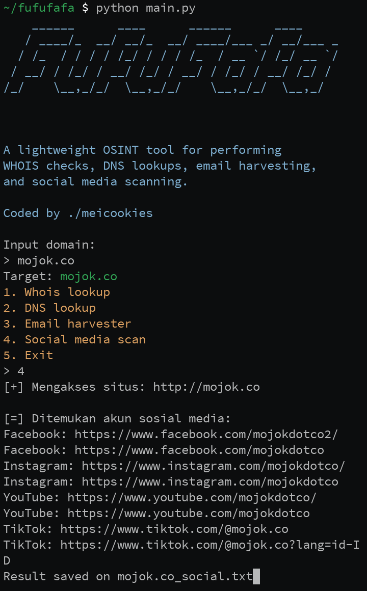
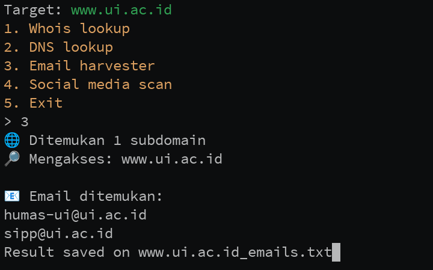

# FufuFafa

**FufuFafa** is a lightweight and user-friendly Open Source Intelligence (OSINT) tool designed for quick reconnaissance tasks. It provides essential features such as WHOIS checks, DNS lookups, email harvesting, and social media scanning, making it ideal for security researchers, penetration testers, and digital investigators.

## ✨ Features

- 🔍 WHOIS Lookup
- 🌐 DNS Lookup (A, MX, NS, CNAME records)
- 📧 Email Harvesting
- 📱 Social Media Scanning (basic username check)

## 🛠️ Installation

Clone the repository:

```bash
git clone https://github.com/meico-wq/fufufafa.git
cd fufufafa
```

Install the dependencies (if any):

```bash
pip install -r requirements.txt
```

## 🚀 Usage

Run the tool from the terminal:

```bash
python main.py
```

## 💻 Screenshot




## 📂 Project Structure

```
FufuFafa/
├── main.py
├── modules/
│   ├── whois_scan.py
│   ├── dns_scan.py
│   ├── email_harvester.py
│   └── social_scan.py
├── requirements.txt
└── README.md
```

Created by [meico-wq](https://github.com/meico-wq)

## ₿ Donate with Bitcoin
My money is not enough to buy a laptop, help me with bitcoin every satoshi helps!

**Bitcoin Wallet Address: 169Eg1dUvrC5xNb3KzGRg4G6ycvgUfrtsn**

